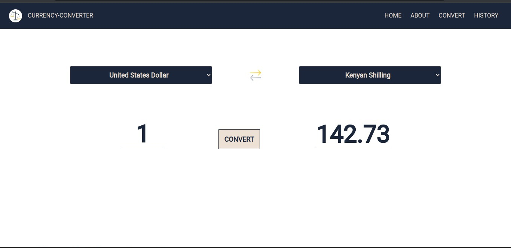
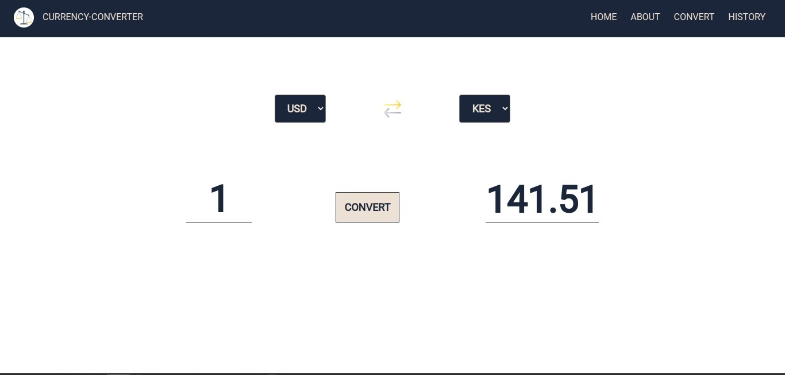

# CURRENCY-CONVERTER 

## DESCRIPTION.

Currency converter is a web application that allows users to convert between two currencies of their choice. It typically provides a user-friendly interface where users can select the source and target currencies and enter the amount they want to convert. The app retrieves the latest exchange rates from an API, and performs the currency conversion calculation based on the user's input. The converted amount is then displayed to the user, providing a convenient way to quickly and accurately convert currencies.

## SET-UP REQUIREMENTS.

- Git.
- Web-browser of your choice.
- Github
- Github ApiKey

## SET-UP /INSTALLATIONS.

- Copy the github repository url
- Clone to your computer
- Open terminal and navigate to the directory of the project you just cloned to your computer
- Run the following command to install all the dependencies

```
npm install
```

- Generate Github ApiKey.

## TECHNOLOGIES USED. 
---

The following languages have been used on this project:

- HTML
- CSS
- Javascript

- Live link to view the project <a href="https://gathoni-wanjira.github.io/Currency-Converter-App/">Currency converter App.</a>

## SCREENSHOTS FROM THE APP. 
---

- HOMEPAGE.
  

- SAMPLE EXCHANGE. 
  
  

- SAMPLE EXCHANGE (cont). 
  
  

- - SAMPLE EXCHANGE (cont). 
  
  


## SUPPORT & CONTACT DETAILS.  
---

To make a contribution to the code used or any suggestions you can click on the contact link and email me your suggestions.

- Email: janetgathoni910@gmail.com

## AUTHOR. 
---

- [Gathoni Wanjira](https://github.com/Gathoni-Wanjira)
